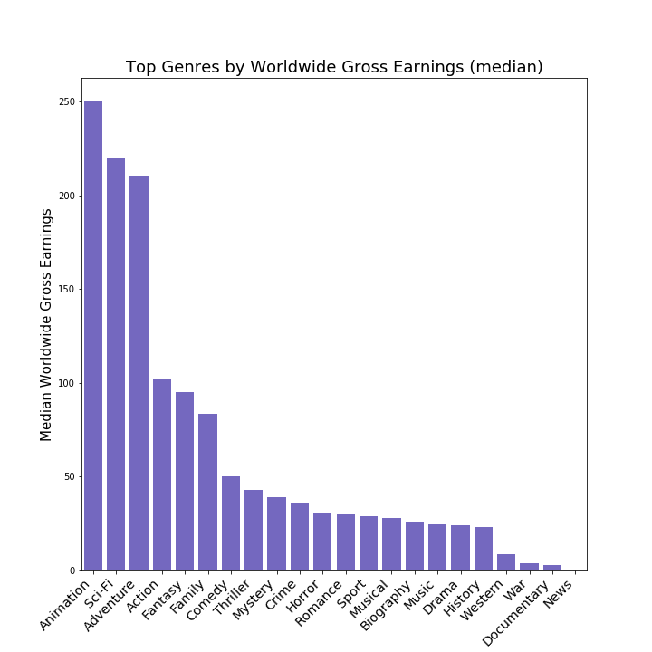

# Paige & Cong's Module 1 Final Project

Source: Rotten Tomatoes
---

# Business Context & Approach

Microsoft is establishing a new movie studio and is gearing up to launch their first feature film. To assist them in this venture, we were tasked with conducting an analysis to determine which types of films are currently performing best at the box office. Our ultimate goal was to provide a series of recommendations that would enable Microsoft to make strategic decisions about which genre of movie to produce, which director to hire, and which month to release the film.

* IMDB
* Box Office Mojo
* Rotten Tomatoes
* TheMovieDB.org

To provide Microsoft with meaningful recommendations, we broke down our analyses into three parts. To determine which genre of movie Microsoft should produce, we examined ratings, worldwide gross bookings, and multiples on money by genre. To determine who Microsoft should hire as the director, we looked at which director had the highest rated movies and which directors generate the highest grossing films.Finally, to determine which month Microsoft should release the film in, we examined worldwide gross bookings by month and by genre.

---

# Findings & Recommendations

## Question 1: Which genre of movie should Microsoft produce?

**Recommendation:** Microsoft should produce a Documentary if they want to optimize for ratings. However, if Microsoft wants to generate the highest multiple on money and gross earnings, they should produce an Animation or Sci-Fi movie.

**Findings:**
* The genres with the highest multiple on money (calculated as worldwide gross / production budget) are: 'Mystery', 'Animation', and 'Sci-Fi'.
* The genres with the highest median worldwide gross earnings is 'Animation', followed by 'Sci-Fi' and 'Adventure'. Especially notable are 'Animation' and 'Sci-Fi' which also ranked highly on the multiple on money analysis, indicating that these are both high return and high absolute revenue genres.
* Since 2010, Drama is the genre with the most movies with a 7.5+ / 10 rating on Imdb (with at least 100 votes). Other notable genres are Documentary and Comedy.
* Documentary is a very attractive genre given its high median rating and a distribution of ratings that really centers around the median. It also had the second highest number of top rated movies based on our analysis from question 5. Drama on the other hand had the most top rated movies. However, this chart illustrates that that was largely driven by a large number of movies produced overall. When looking at the chart above, Drama ranks low on the median rating, and has a wider distribution.

---
## Question 2: Who should Microsoft hire as the director?

**Recommendation:** If Microsoft elects to produce a Documentary, they should hire Paul Dugdale. If Microsoft decides to produce an Animation or Sci-Fi film, they should hire Denis Villeneuve. 

**Findings:**
Since 2010, Paul Dugdale has directed the most movies with a 7.5+ / 10 rating on Imdb (with at least 100 votes). Dugdale directed six, with Ganguly and Villeneuve directing five, and a group including Scorsese and Nolan directing four.

--- 
## Question 3: When should Microsoft release the film?

**Recommendation:** Microsoft should release their movie in June or July. 
**Findings:** The summer months of June and July have the highest multiple on money releases.

---
# Limitations
* There is a lack of unique identifiers across datatables. 
* Since many movies have the same title, joining on movie title often resulted in inaccurate information. In these cases, we opted to include no information rather than false information.
